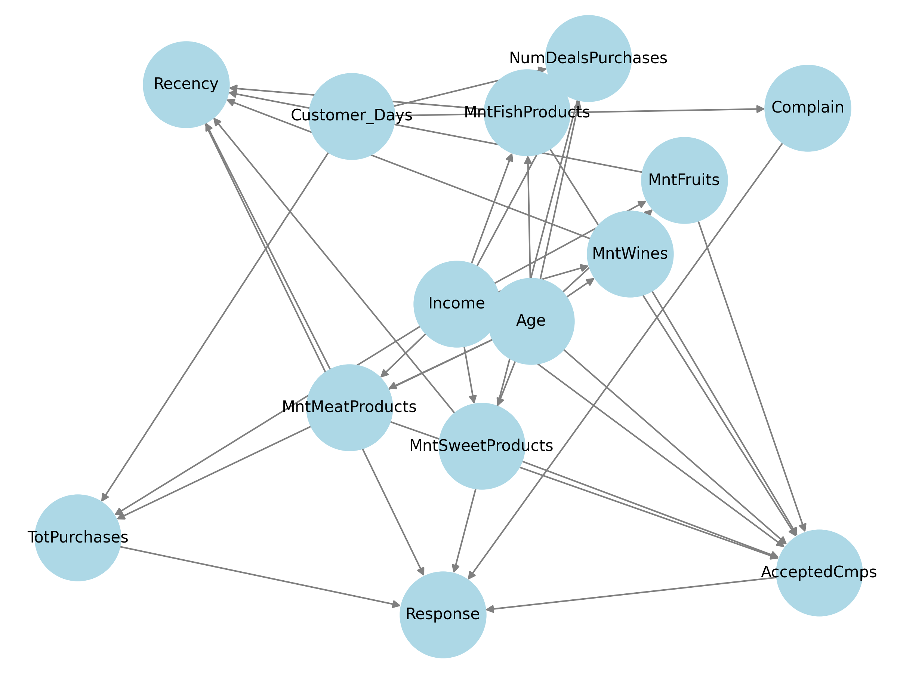

# Bayesian Network for Marketing Analytics

## Project Overview
This project applies **Bayesian Networks** to analyze and explain customer behavior in marketing analytics. Using probabilistic modeling, I uncover relationships between various customer attributes and purchasing decisions, providing **data-driven insights** for marketing strategies.

## Dataset
I use the **[Marketing Data](https://www.kaggle.com/datasets/jackdaoud/marketing-data)** dataset, which contains customer demographics, spending habits, and responses to marketing campaigns. Key features include:

- **Demographics:** Age, income, family size, etc.
- **Purchase behavior:** Number of purchases, deals used, campaign responses.
- **Engagement:** Recency of last purchase, complaints, responses to past campaigns.

Due to memory constraints, the dataset was **simplified** to optimize performance. The processed version of the dataset is attached as `data_simplified.csv`.

## Objectives
- **Understand customer behavior**: Identify factors influencing purchases and responses to marketing campaigns.
- **Predict outcomes**: Estimate the probability of a customer engaging with a campaign.
- **Compare inference methods**: Use **exact inference** vs. **sampling-based inference** for probabilistic predictions.

## Methodology
1. **Preprocessing**:
   - Discretized continuous variables using **quantile binning**.
   - Encoded categorical variables using **label encoding**.
   - Constructed a **mapping** to interpret bin ranges back to original values.
   - **Simplified the dataset** to avoid exceeding memory limits.

2. **Bayesian Network Modeling**:
   - Built a **Bayesian Network** using **pgmpy**.
   - Defined conditional dependencies between customer attributes and purchasing behavior.
   - Performed inference to estimate probabilities of key customer outcomes.
   - **Visualized the network structure** to better understand relationships.

3. **Inference & Analysis**:
   - Queried the model using **lightweight sampling**.
   - Extracted the most probable outcomes given specific customer conditions.
   - Mapped inferred probabilities back to original customer attributes.

## Bayesian Network Structure
The **Bayesian Network** models probabilistic dependencies between customer attributes. The network is represented as a directed graph where:
- **Nodes** represent variables such as **income, age, purchases, and responses**.
- **Edges** indicate conditional dependencies, showing how one variable influences another.

Below is the **graphical representation** of the Bayesian Network:

This structure helps in understanding the **causal relationships** and predicting customer behavior based on known factors.

## Key Features & Implementation
- **Querying Customer Outcomes**: Given attributes like income, age, or recency of purchase, I estimate the most probable marketing response.
- **Visualizing Probability Distributions**: Compared probabilities from different inference techniques using bar plots.
- **Natural Language Interpretation**: Translated results into readable insights, e.g.,
  > "Given an income from $50,000$ to $100,000$, the most probable outcome is campaign acceptance with a probability of 72.45%."

## Tools & Libraries
- **Python** (pandas, numpy, sklearn, pgmpy, matplotlib)
- **Bayesian Network Modeling**: pgmpy
- **Data Processing**: sklearn (LabelEncoder, KBinsDiscretizer)
- **Visualization**: matplotlib, networkx

## Results & Insights
- Customers with **higher income levels** are more likely to respond to campaigns.
- Recent purchases **reduce** the probability of engagement in new campaigns.
- The number of deal-based purchases **correlates** with the likelihood of future responses.

## Future Enhancements
- Expand the model with **time-series analysis** for evolving customer behavior.
- Implement **causal inference** to identify the direct impact of marketing strategies.
- Optimize inference methods for **real-time predictions** in marketing automation.

## Conclusion
This project demonstrates how **Bayesian Networks** can model customer behavior, predict responses, and provide actionable marketing insights based on probabilistic reasoning.

